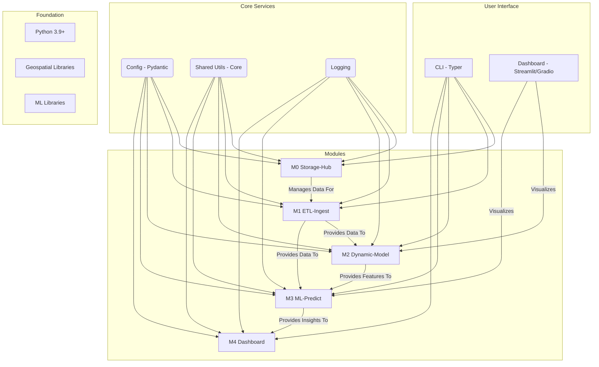

# FastClime

[](https://github.com/JohanPime/fastclime/actions/workflows/ci.yml)
[](https://github.com/JohanPime/fastclime/actions/workflows/ci.yml)
[](https://johanpime.github.io/fastclime/)
[](https://badge.fury.io/py/fastclime)
[](https://opensource.org/licenses/MIT)

Geospatial + ML climate-simulation toolkit.

## Vision

FastClime is a toolkit for climate simulation and irrigation management, built on raster geodata and machine learning. This project aims to provide a solid foundation for developing and deploying five key modules:

*   **M0 Storage-Hub:** Unified management of raw data and artifacts.
*   **M1 ETL-Ingest:** Download and clean datasets (DEM, SMAP, NDVI, etc.).
*   **M2 Dynamic-Model:** Physical soil-plant-atmosphere calculations (ETo, ETc, deficit).
*   **M3 ML-Predict:** Risk and optimization models (LightGBM, RL, etc.).
*   **M4 Dashboard:** Visualization and APIs (Streamlit/Gradio + notebooks).

This repository contains the core infrastructure to allow each module to be developed as an internal package.

## Architecture

The project is structured as a monolithic repository with a modular architecture. Each module is a sub-package within the `src/fastclime` directory. A central CLI application discovers and integrates commands from each module.



## How to Contribute

1.  **Set up the environment:**
    ```bash
    # Clone the repository
    git clone https://github.com/JohanPime/fastclime.git
    cd fastclime

    # Install dependencies
    pip install -e ".[dev,docs]"
    ```
2.  **Install pre-commit hooks:**
    ```bash
    pre-commit install
    ```
3.  **Create a new branch** for your feature or bug fix.
4.  **Make your changes.**
5.  **Run tests and linters:**
    ```bash
    pytest
    ruff check --fix .
    black .
    ```
6.  **Submit a pull request.**

## Quick-start ML

Train a model to predict water stress:
```bash
fastclime predict train stress_clf
```

Generate predictions for a new dataset:
```bash
fastclime predict batch --model stress_clf --csv-in samples.csv --csv-out predictions.csv
```

## Roadmap

-   [x] **M0 Storage-Hub:** Unified data and artifact management.
-   [x] **M1 ETL-Ingest:** Dataset download and cleaning pipeline.
-   [x] **M2 Dynamic-Model:** Soil-plant-atmosphere physics calculations.
-   [x] **M3 ML-Predict:** Risk and optimization models.
-   [ ] **M4 Dashboard:** Visualization and APIs.
---

*This project was bootstrapped by Jules, an AI software engineer.*
