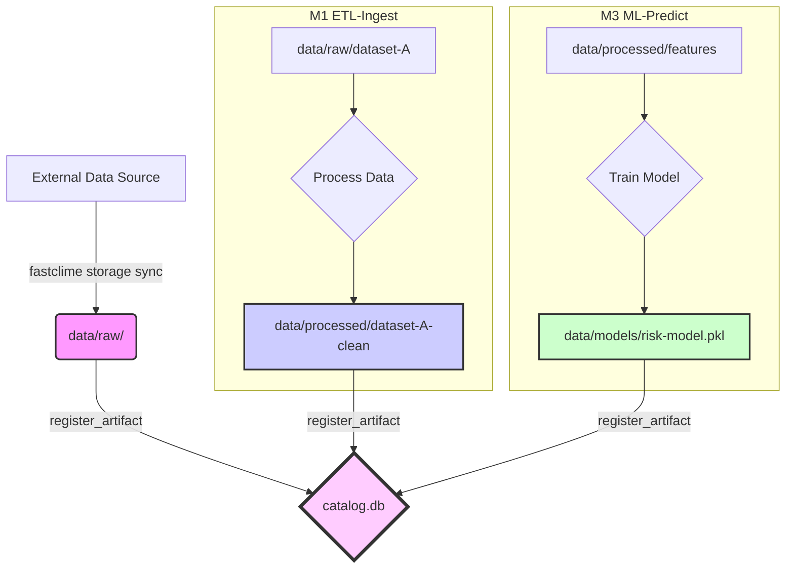

# M0: Storage-Hub

The Storage-Hub is the foundational module of FastClime. It provides a standardized directory structure and a data catalog to manage all raw data, processed artifacts, and models.

## Overview

The core responsibilities of this module are:
-   **Initialization**: To create a consistent folder structure for all data assets via `fastclime storage init`.
-   **Path Management**: To provide helper functions (`data_path`) that generate correct, predictable file paths.
-   **Data Cataloging**: To maintain a database (`catalog.db`) that tracks metadata about datasets and file artifacts, including versions and checksums for integrity.

## Directory Schema

All data is stored within a main `DATA_DIR`, which defaults to `~/.fastclime/data` but can be configured via the `FASTCLIME_DATA_DIR` environment variable. The structure is as follows:

| Path        | Description                                     |
|-------------|-------------------------------------------------|
| `raw/`      | Original, immutable source data.                |
| `processed/`| Intermediate or final data products.            |
| `models/`   | Trained machine learning models.                |
| `tmp/`      | Temporary files, can be safely deleted.         |
| `catalog.db`| DuckDB file containing all metadata.            |

## Data Flow

The typical flow of data through the storage hub is illustrated below. Raw data is ingested, registered in the catalog, processed into new artifacts (which are also registered), and then used to train models.

