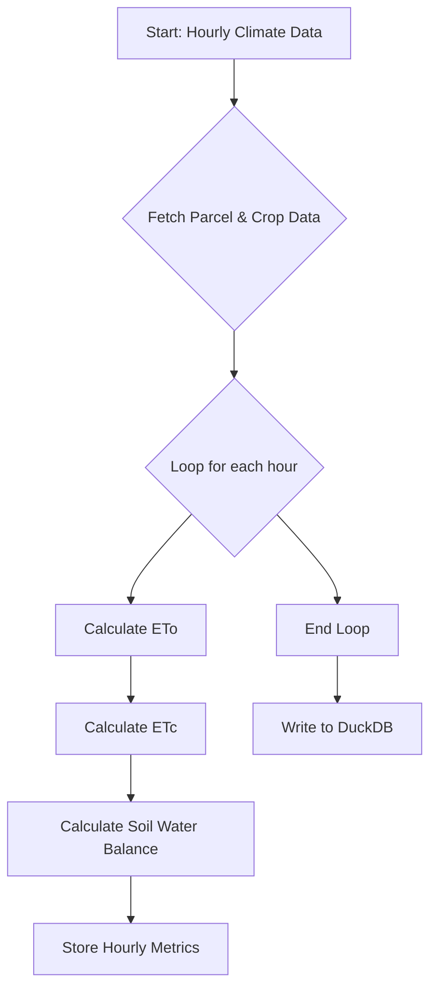

# M2 – Dynamic Model (Water Balance)

This module implements the core dynamic water balance model based on the **FAO-56 Penman-Monteith** methodology. It calculates the hourly evolution of water in the soil profile for a given agricultural parcel.

## Key Calculations

The model performs the following key calculations on an hourly basis:

1.  **Reference Evapotranspiration (ETo):** The rate of evapotranspiration from a hypothetical grass reference surface.
2.  **Crop Evapotranspiration (ETc):** The specific evapotranspiration for the actual crop being grown, calculated using a crop coefficient (Kc).
3.  **Soil Water Balance:** A running tally of the water depletion in the root zone, accounting for inputs (precipitation) and outputs (ETc).
4.  **Crop Stress Coefficients:** Calculation of `Ks` (water stress coefficient) and the Hydric Stress Index (`ISH`) to quantify crop water stress.

## Workflow

The following diagram illustrates the workflow for the hourly simulation:

## Core Equations

### Reference Evapotranspiration (ETo)

The model uses the FAO-56 Penman-Monteith equation for hourly time steps:

$$
ET_o = \\frac{0.408 \\Delta (R_n - G) + \\gamma \\frac{37}{T_{hr} + 273} u_2 (e_s - e_a)}{\\Delta + \\gamma (1 + 0.34 u_2)}
$$

Where:
- $ET_o$: Reference evapotranspiration [mm hour⁻¹]
- $R_n$: Net radiation at the crop surface [MJ m⁻² hour⁻¹]
- $G$: Soil heat flux density [MJ m⁻² hour⁻¹]
- $T_{hr}$: Mean hourly air temperature [°C]
- $u_2$: Wind speed at 2 m height [m s⁻¹]
- $e_s$: Saturation vapour pressure [kPa]
- $e_a$: Actual vapour pressure [kPa]
- $\\Delta$: Slope of the saturation vapour pressure curve [kPa °C⁻¹]
- $\\gamma$: Psychrometric constant [kPa °C⁻¹]

### Crop Evapotranspiration (ETc)

ETc is calculated using the crop coefficient approach:

$$
ET_c = K_c \\times ET_o
$$

Where:
- $K_c$: Crop coefficient (dimensionless)

### Soil Water Balance (Root Zone Depletion)

The depletion at the end of a period is calculated as:

$$
D_{end} = D_{start} - P_e - I + ET_c
$$

Where:
- $D_{start}$: Depletion at the start of the period [mm]
- $P_e$: Effective precipitation [mm]
- $I$: Irrigation [mm]
- $ET_c$: Crop evapotranspiration [mm]
