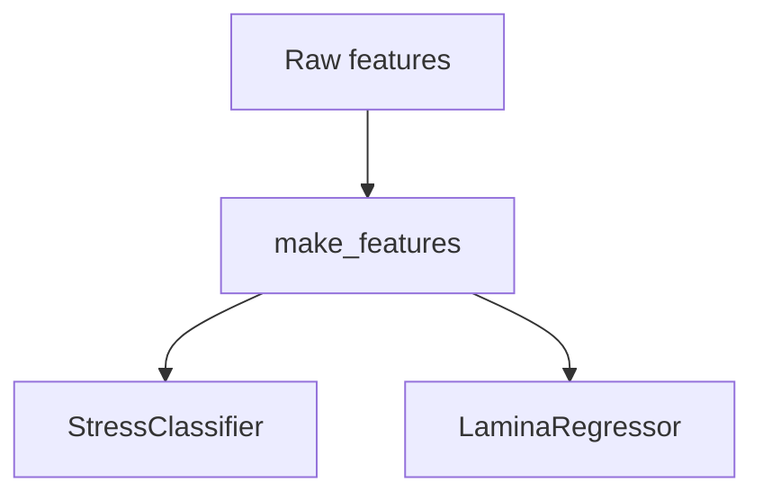

# M3 · ML-Predict

## Flujo general


## Features

| Nombre           | Fuente   | Tipo |
| ---------------- | -------- | ---- |
| deficit\_now\_mm | M2       | num  |
| eto              | M2       | num  |
| rain\_24h        | M1       | num  |
| ndvi             | M1       | num  |
| doy              | derivada | num  |

## Cómo entrenar

```bash
fastclime predict train stress_clf --n-estimators 100
```

## Cómo predecir

```bash
fastclime predict batch \
  --model stress_clf \
  --csv-in samples.csv --csv-out preds.csv
```
